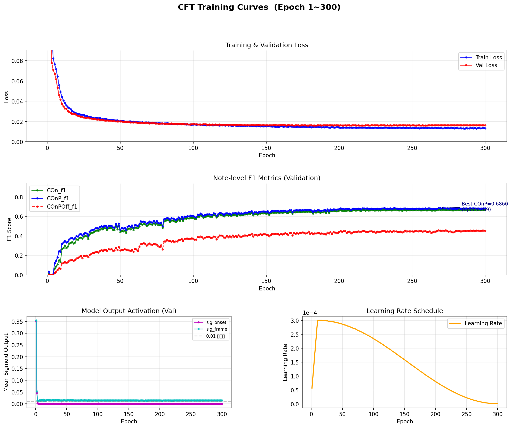

# CFH-Transformer (CFT) — 论文复现与改进

基于论文 **"CFH-Transformer: A Cross-domain Feature Harmonization Transformer for Singing Voice Transcription"** 的严格复现实现，并在以下方面对原始代码进行了修正。

## 修正内容（相较于原始实现）

| 修正项 | 原始实现 | 修正后 | 依据 |
|--------|---------|--------|------|
| 卷积核 octave 维度 | `octave_depth=3` | `octave_depth=4` | 论文 Section 3.3：kernel size (4, 3/5/7, 3) |
| 卷积核 time 维度 | `time_width=1` | `time_width=3` | 论文 Section 3.3：kernel size (4, 3/5/7, 3) |
| FH Transformer PE | 固定正弦 PE | 可学习 PE (`LearnablePE`) | 论文 Section 2.3：learnable temporal embedding |
| HT Transformer PE | 固定正弦 PE | 可学习 PE (`LearnablePE`) | 论文 Section 2.3：learnable frequency-wise PE |
| TF Transformer PE | 固定正弦 PE | 可学习 PE (`LearnablePE`) | 论文 Section 2.3：learnable harmonic-wise PE |

## 模型参数量

| 版本 | 参数量 |
|------|--------|
| 原始实现 | 944,048 |
| 修正版（本仓库） | 2,403,664 |

## 训练结果

训练共进行 **300 个 Epoch**，在 MIR-ST500 测试集（100 首歌曲）上的最终评估结果如下：

| 指标 | 验证集最优 | 测试集 |
|------|-----------|--------|
| **COn F1**（音符起始） | — | **0.6585** |
| **COnP F1**（起始+音高） | **0.6860** | **0.6756** |
| **COnPOff F1**（起始+音高+结束） | — | **0.4192** |

> 评估阈值：onset_thresh = 0.10，frame_thresh = 0.35（训练过程中通过 threshold search 自动确定最优值）

### 训练曲线



训练曲线显示：
- **Loss**：训练损失与验证损失高度吻合，无明显过拟合，收敛稳定
- **F1 指标**：COnP F1 在约 Epoch 100 后趋于平稳，最优值出现在 Epoch 209（COnP = 0.6860）
- **学习率**：采用 LinearWarmup(10 epochs) + CosineAnnealing 调度策略

## 环境要求

```
Python 3.10
PyTorch 2.1.0+cu121
CUDA 12.1
mir_eval
librosa
torchaudio
numpy
pyyaml
```

安装依赖：

```bash
pip install torch torchaudio mir_eval librosa numpy pyyaml tensorboard
```

## 数据集

使用 [MIR-ST500](https://github.com/york135/singing_transcription_ICASSP2021) 数据集：

- 500 首歌曲，含人声音频和音符标注
- 划分：360 训练 / 40 验证 / 100 测试
- 预计算 CQT 特征（288 bins，hop=320，fmin=48.9994 Hz）

## 训练

修改 `config.yaml` 中的路径后运行：

```bash
python train.py
```

恢复训练：

```bash
python train.py --resume checkpoints/latest.pt
```

## 评估

使用原始音频评估：

```bash
python evaluate.py --config config.yaml --checkpoint checkpoints/best_model.pt --split test
```

使用预计算 CQT（npy）评估（更快）：

```bash
python evaluate_npy.py --config config.yaml --checkpoint checkpoints/best_model.pt --split test --onset_thresh 0.10 --frame_thresh 0.35
```

## 训练配置

详见 `config.yaml`，主要参数：

| 参数 | 值 |
|------|-----|
| batch_size | 16 |
| learning_rate | 3e-4 |
| epochs | 300 |
| optimizer | AdamW |
| lr_schedule | LinearWarmup(10) + CosineAnnealing |
| loss | BCE（均等权重） |

## 代码结构

```
├── model_v2.py              # CFT 模型（修正版，本仓库主要贡献）
├── model_v2_backup.py       # 原始模型（对照用）
├── train.py                 # 训练脚本
├── dataset.py               # 数据集加载
├── evaluate.py              # 测试集评估（原始音频版）
├── evaluate_npy.py          # 测试集评估（预计算 npy 版，更快）
├── prepare_splits.py        # 数据集划分
├── precompute_cqt_paper.py  # CQT 预计算
├── config.yaml              # 训练配置
├── eval_results.json        # 测试集评估结果（逐曲目）
├── training_curves.png      # 训练曲线图（Epoch 1~300）
└── splits/                  # 数据集划分文件
    ├── train.txt
    ├── val.txt
    └── test.txt
```
